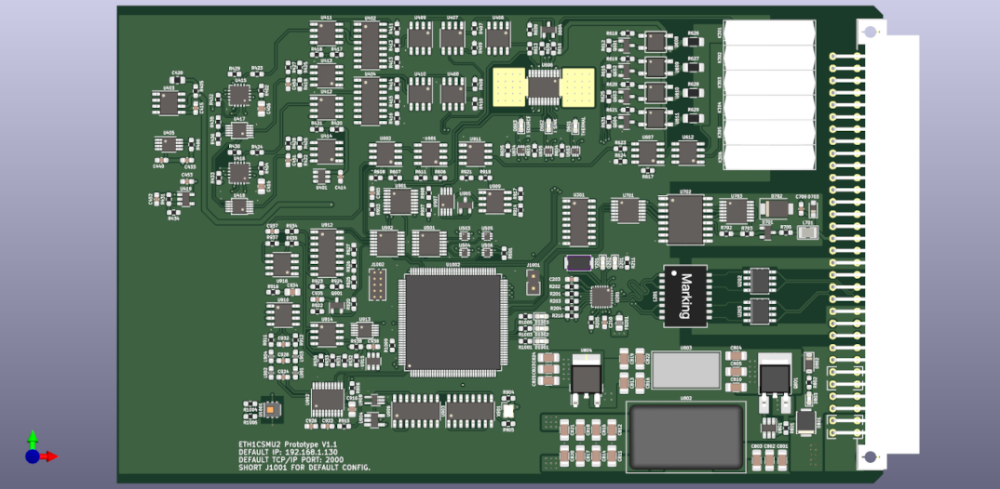
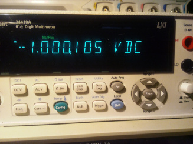
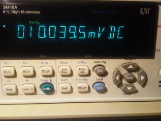
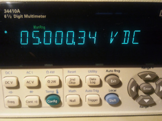
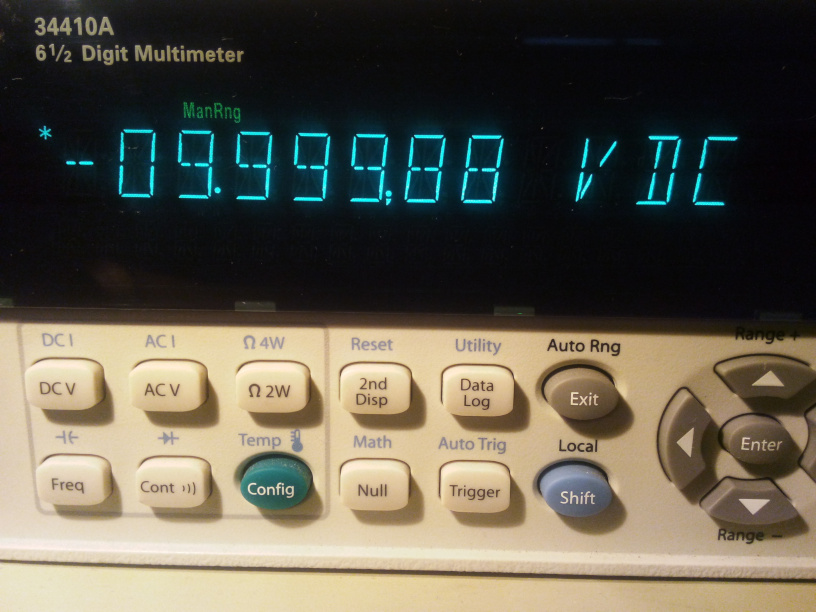

# ETH1CSMU2
> Yet another poor man's SMU based on LT1970 Power Op Amp.

## What is a SMU ?

A Source Measurement Unit (SMU) is a versatile electronic instrument used in various applications, particularly in the field of electronics testing and characterization. It combines the functionalities of both a voltage source and a current measurement device.

## What is ETH1CSMU2 ?

ETH1CSMU2 is an ongoing hobby project focused on the development of a cost-effective Source Measurement Unit (SMU). The PCB has been designed in accordance with the Eurocard standard size, measuring 160x100 mm. It should be noted that the PCB is intended for integration with a Backplane, such as the [DIN41612_Backplane](https://github.com/BehrensG/DIN41612_Backplane), and is not intended for standalone operation (but it can be).
The PCB requires 24V DC supply. The device can sink and source voltage and current. Can generate a AC sine signal. The PCB includes pars of two ADCs for measurements. 2xADS868 designed the DC output mode, 2xAD7980 designed for AC output mode.

## Parameters

### DC
- Voltage output 11V (bipolar)
- Minimal set voltage step 1mV
- Current ranges 200uA, 2mA, 20mA and 200mA (bipolar)

### AC

- Sine wave generator
- Amplitude 6 V (bipolar)
- Offset 11 V (bipolar)
- Frequency 200 kHz

## Resources
- SCPI parser - https://github.com/j123b567/scpi-parser
- KiCAD - https://www.kicad.org
- STM32CubeIDE - https://www.st.com/en/development-tools/stm32cubeide.html
- POOR MAN'S SMU - https://poormanssmu.wordpress.com
- FreeRTOS - https://www.freertos.org/

## Images

 ETH1CSMU2 

  
 

 Examples of the output voltages 

  
   
   
   
 

## Status

Project is ongoing. 

#### TBD:
1. Missing code for ADCs calibration.
2. Missing code for the trigger circuit. 
3. Need to improve the AC code.
4. More images in this README file.
5. Missing SCPI commands documentation.

**NOTE**: When using KiCAD project it will be required to change the schematic and PCB libraries paths.
